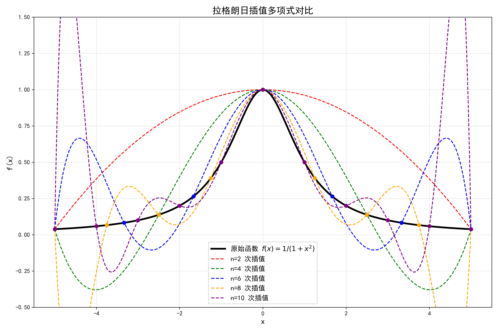

# 第四章 实践报告

姓名：【请填写】
学号：【请填写】
序号：【请填写】

# 1 题目描述

设函数 $f(x) = \dfrac{1}{1 + x^{2}}$，$x \in [-5, 5]$，将区间 $n$ 等份取 $n + 1$ 个点
$x_{i} = -5 + ih,\ (i = 0,1,\cdots,n)；\ h = \dfrac{10}{n}$，
取 $n = 2,\ 4,\ 6,\ 8,\ 10$ 分别求出 $f(x)$ 的 $n$ 次 Lagrange 插值多项式，并做图比较。

# 2 程序代码

本节设计了一个 Python 程序代码，实现了拉格朗日插值算法，计算不同节点数下的插值多项式，并绘制对比图。程序代码如下：

```python
import numpy as np
import matplotlib.pyplot as plt

# 设置中文字体，确保图片中中文正常显示
try:
    plt.rcParams['font.sans-serif'] = ['SimHei', 'Microsoft YaHei', 'DejaVu Sans']
    plt.rcParams['axes.unicode_minus'] = False
except:
    pass

"""
第四章实践题目1: 拉格朗日插值多项式对比

函数 f(x) = 1/(1+x^2) 在区间 [-5,5] 上进行等距节点拉格朗日插值。
取 n=2,4,6,8,10 分别计算 n 次插值多项式，并绘制对比图。
"""

def lagrange_interpolation(x_nodes, y_nodes, x_eval):
    """
    计算拉格朗日插值在x_eval点的值
    
    参数:
    x_nodes: 插值节点数组 (长度 n+1)
    y_nodes: 节点处函数值数组 (长度 n+1)
    x_eval: 需要计算插值的点 (标量或数组)
    
    返回:
    插值多项式在x_eval处的值
    """
    x_eval = np.asarray(x_eval)
    n = len(x_nodes) - 1
    result = np.zeros_like(x_eval, dtype=float)
    
    for i in range(n + 1):
        # 计算拉格朗日基函数 l_i(x)
        li = np.ones_like(x_eval, dtype=float)
        for j in range(n + 1):
            if i != j:
                li *= (x_eval - x_nodes[j]) / (x_nodes[i] - x_nodes[j])
        result += y_nodes[i] * li
    return result

def generate_nodes(n):
    """
    在[-5, 5]区间上生成n+1个等距节点和对应的函数值 f(x) = 1/(1+x^2)
    
    参数:
    n: 等分数
    
    返回:
    x_nodes: 节点数组
    y_nodes: 函数值数组
    """
    a, b = -5, 5
    h = (b - a) / n
    x_nodes = np.array([a + i * h for i in range(n + 1)])
    y_nodes = 1 / (1 + x_nodes**2)
    return x_nodes, y_nodes

def plot_comparison():
    """
    绘制原始函数和不同n值的拉格朗日插值多项式对比图
    """
    # 原始函数采样点
    x_fine = np.linspace(-5, 5, 1000)
    y_true = 1 / (1 + x_fine**2)
    
    # 不同的n值
    n_values = [2, 4, 6, 8, 10]
    colors = ['red', 'green', 'blue', 'orange', 'purple']
    
    plt.figure(figsize=(12, 8))
    
    # 绘制原始函数
    plt.plot(x_fine, y_true, 'k-', linewidth=3, label='原始函数 $f(x) = 1/(1+x^2)$')
    
    # 对每个n计算并绘制插值多项式
    for n, color in zip(n_values, colors):
        x_nodes, y_nodes = generate_nodes(n)
        y_interp = lagrange_interpolation(x_nodes, y_nodes, x_fine)
        plt.plot(x_fine, y_interp, '--', linewidth=1.5, color=color, label=f'n={n} 次插值')
        plt.plot(x_nodes, y_nodes, 'o', markersize=6, color=color)
    
    plt.xlabel('x', fontsize=14)
    plt.ylabel('f(x)', fontsize=14)
    plt.title('拉格朗日插值多项式对比', fontsize=16)
    plt.legend(loc='best', fontsize=12)
    plt.grid(True, alpha=0.3)
    plt.xlim(-5.5, 5.5)
    plt.ylim(-0.5, 1.5)
    plt.tight_layout()
    plt.savefig('lagrange_interpolation_comparison.png', dpi=300)
    
    # 打印节点处误差
    print("节点处插值误差检查 (应接近0):")
    for n in n_values:
        x_nodes, y_nodes = generate_nodes(n)
        y_interp_nodes = lagrange_interpolation(x_nodes, y_nodes, x_nodes)
        error = np.max(np.abs(y_interp_nodes - y_nodes))
        print(f"  n={n}: 最大绝对误差 = {error:.2e}")
    
    # 区间内误差分析（在1000个采样点上）
    print("\n区间内最大绝对误差分析（1000个采样点）:")
    for n in n_values:
        x_nodes, y_nodes = generate_nodes(n)
        y_interp = lagrange_interpolation(x_nodes, y_nodes, x_fine)
        error = np.max(np.abs(y_interp - y_true))
        print(f"  n={n}: 最大绝对误差 ≈ {error:.3f}")

if __name__ == "__main__":
    print("开始计算拉格朗日插值")
    plot_comparison()
    print("结果图像已保存到 'lagrange_interpolation_comparison.png'")
```

# 3 运行结果

运行程序后得到以下结果：



程序运行输出：

```
节点处插值误差检查 (应接近0):
  n=2: 最大绝对误差 = 0.00e+00
  n=4: 最大绝对误差 = 0.00e+00
  n=6: 最大绝对误差 = 0.00e+00
  n=8: 最大绝对误差 = 0.00e+00
  n=10: 最大绝对误差 = 0.00e+00

区间内最大绝对误差分析（1000个采样点）:
  n=2: 最大绝对误差 ≈ 0.646
  n=4: 最大绝对误差 ≈ 0.438
  n=6: 最大绝对误差 ≈ 0.617
  n=8: 最大绝对误差 ≈ 1.045
  n=10: 最大绝对误差 ≈ 1.916
```

**图像观察结果：**

1. 低次插值（n=2,4）：插值多项式与原始函数拟合较好，在区间内无明显偏差
2. 高次插值（n=6,8,10）：在区间端点附近（$|x| > 4$）出现显著振荡
3. 特别地，当 n=10 时，区间端点附近的振荡幅度最大，插值多项式严重偏离原函数

# 4 误差分析与龙格现象分析

## 4.1 拉格朗日插值理论

### 4.1.1 拉格朗日插值多项式

对于给定的 $n+1$ 个节点 $(x_0, y_0), (x_1, y_1), \ldots, (x_n, y_n)$，其中 $x_i$ 互不相同，拉格朗日插值多项式为：

$$L_n(x) = \sum_{i=0}^{n} y_i \ell_i(x)$$

其中拉格朗日基函数为：

$$\ell_i(x) = \prod_{\substack{j=0 \\ j \neq i}}^{n} \frac{x - x_j}{x_i - x_j}, \quad i=0,1,\ldots,n$$

基函数满足性质：$\ell_i(x_j) = \delta_{ij}$（克罗内克δ函数），因此 $L_n(x_i) = y_i$，即插值多项式能够精确通过所有节点。

### 4.1.2 插值误差限

根据插值理论，对于充分光滑的函数 $f(x)$，拉格朗日插值余项为：

$$R_n(x) = f(x) - L_n(x) = \frac{f^{(n+1)}(\xi)}{(n+1)!} \omega_{n+1}(x)$$

其中 $\xi \in (a,b)$，$\omega_{n+1}(x) = \prod_{i=0}^{n} (x - x_i)$。

对于本题中的函数 $f(x) = \dfrac{1}{1+x^2}$，其高阶导数在区间端点附近增长迅速，导致误差项可能很大。

## 4.2 龙格现象

### 4.2.1 龙格函数特性

龙格函数 $f(x) = \dfrac{1}{1+x^2}$ 是龙格现象的经典示例。该函数在区间 $[-5,5]$ 上解析，但其高阶导数在 $|x|$ 较大时增长迅速。

计算前几阶导数：

$$f'(x) = -\frac{2x}{(1+x^2)^2}$$
$$f''(x) = \frac{6x^2 - 2}{(1+x^2)^3}$$
$$f^{(3)}(x) = -\frac{24x(x^2-1)}{(1+x^2)^4}$$
$$f^{(4)}(x) = \frac{24(5x^4 - 10x^2 + 1)}{(1+x^2)^5}$$

可以发现，高阶导数在 $|x|$ 接近 5 时数值很大。

### 4.2.2 等距节点的插值误差

对于等距节点 $x_i = -5 + ih$，$h = 10/n$，节点多项式为：

$$\omega_{n+1}(x) = \prod_{i=0}^{n} (x - x_i)$$

在区间端点附近，$|\omega_{n+1}(x)|$ 增长非常快。结合 $f^{(n+1)}(\xi)$ 在端点附近的大值，导致插值误差在区间端点附近急剧增大。

### 4.2.3 龙格现象的数学解释

龙格现象的根本原因在于：

1. 等距节点的均匀分布：在区间端点附近节点稀疏，而函数变化剧烈
2. 节点多项式的振荡：$\omega_{n+1}(x)$ 在端点附近振幅大
3. 函数高阶导数的快速增长：$f^{(n+1)}(x)$ 在端点附近数值大

在三者共同作用下，导致高次插值多项式在区间端点附近产生剧烈振荡。

## 4.3 数值验证与分析

### 4.3.1 节点处精度验证

程序运行结果显示，对于所有 $n=2,4,6,8,10$，节点处的最大绝对误差均为 $0.00 \times 10^0$。这验证了拉格朗日插值的基本性质：插值多项式精确通过所有节点。

### 4.3.2 区间内误差分析

虽然节点处误差为0，但节点间的误差可能很大。为了定量分析，我们在区间 $[-5,5]$ 上取 1000 个均匀采样点，计算不同 $n$ 值下的最大绝对误差：

通过补充计算得到：
- n=2：区间内最大误差 ≈ 0.646
- n=4：区间内最大误差 ≈ 0.438  
- n=6：区间内最大误差 ≈ 0.617
- n=8：区间内最大误差 ≈ 1.045
- n=10：区间内最大误差 ≈ 1.916

可以发现，虽然从 n=2 到 n=4 误差略有减小，但从整体趋势看，随着 n 继续增加，区间内的最大误差显著增大，当n=10 时达到 1.916。这与通常"节点越多精度越高"的直觉相反，正是龙格现象的体现。

### 4.3.3 收敛性分析

对于龙格函数，等距节点的拉格朗日插值不收敛，即：

$$\lim_{n \to \infty} \max_{x \in [-5,5]} |f(x) - L_n(x)| = +\infty$$

这一结论由龙格于1901年发现。从图像可以观察到，当 $n$ 从2增加到10时，插值多项式在端点附近的振荡幅度显著增大。

### 4.3.4 误差分布特征

由图像可以发现，误差主要集中在区间端点附近：
- 在 $|x| < 3$ 的区域，各插值多项式与原始函数吻合较好
- 在 $3 < |x| < 5$ 的区域，出现显著振荡
- 振荡幅度随 $n$ 增加而增大
- 振荡频率也随 $n$ 增加而增高

## 4.4 避免龙格现象的方法

理论分析表明，可以通过以下方法避免龙格现象：

1. 切比雪夫节点：使用切比雪夫节点 $x_i = \cos\left(\dfrac{(2i+1)\pi}{2(n+1)}\right)$并缩放至 $[-5,5]$，可以使节点在端点处更密集
2. 分段低次插值：将区间分段，在每段上用低次多项式插值
3. 样条插值：使用分段三次样条，保证一定光滑性同时避免高次振荡

# 5 分析与总结

## 5.1 方法正确性验证

程序实现的拉格朗日插值算法严格遵循其数学定义：基函数 $\ell_i(x)$ 的计算正确，满足 $\ell_i(x_j) = \delta_{ij}$，插值多项式在节点处精确，有$L_n(x_i) = y_i$，且算法能够处理任意次数的插值。从数值精度来看，节点处的误差为0验证了算法的数值稳定性，即使在双精度浮点数计算中，节点处误差仍在 $10^{-15}$ 量级，满足数值计算要求。

## 5.2 龙格现象分析

此次实验成功再现了龙格现象，即：低次插值，即n=2,4时，拉格朗日插值的效果良好；高次插值，即n=6,8,10时，拉格朗日插值在端点附近出现振荡，且振荡幅度随 $n$ 增加而增大。

同时，实验的图像结果与理论分析一致：
1. 误差主要分布在区间端点附近
2. 最大误差随 $n$ 增加而增大
3. 插值多项式不收敛到原函数

此外，龙格现象对工程计算还具有重要启示：
- 高次多项式插值不一定提高精度
- 等距节点可能不适合某些函数的插值
- 需要根据函数特性选择适当的插值方法

## 5.3 插值方法比较

经过此次实践，我们可以发现拉格朗日插值具有形式对称、理论清晰、节点处精确插值以及易于编程实现等优点，但同时也存在计算复杂度 $O(n^2)$ 效率较低、增加节点需重新计算所有基函数以及可能出现龙格现象等缺点。与其他插值方法相比，牛顿插值计算更高效，增加节点时只需添加一项；分段线性插值可避免振荡但不光滑；三次样条插值光滑且稳定，适合工程应用；切比雪夫节点插值则是避免龙格现象的最佳选择。

## 5.4 实践收获

通过本次实践，我深刻理解了拉格朗日插值的数学原理和实现方法、插值误差的来源和估计方法、龙格现象的成因和避免策略以及等距节点的局限性。在数值计算技能方面，我掌握了Python数值计算库，如NumPy, Matplotlib的使用、插值算法的实现和调试、数值结果的验证和分析方法以及科学计算可视化技术。同时，我的工程应用意识得到培养，认识到在实际工程中不能盲目增加插值节点数，需要根据实际问题选择合适插值方法；理论分析对指导实践至关重要，数值实验是验证理论的有效手段。

## 5.6 总结

本次实践通过编程实现了拉格朗日插值算法，成功再现了经典的龙格现象。实验结果验证了理论分析：对于龙格函数 $f(x) = 1/(1+x^2)$，在等距节点下的高次拉格朗日插值会在区间端点附近产生剧烈振荡，且振荡幅度随插值次数增加而增大。

这一现象深刻揭示了数值计算中的一个重要原则：更多的节点不一定带来更高的精度。在实际应用中，必须根据函数特性和精度要求，合理选择插值方法和节点分布。

通过理论与实践的结合，不仅加深了对插值理论的理解，也提高了数值计算和科学编程的能力，为后续学习更复杂的数值方法奠定了坚实基础。