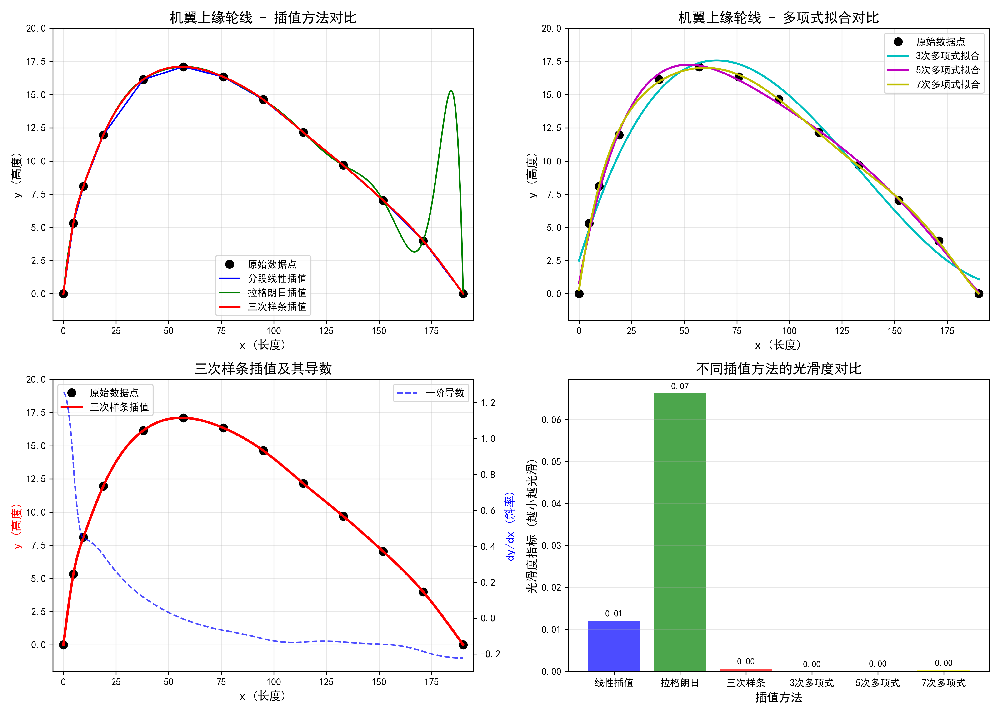

# 第五章 实践报告

姓名：【请填写】
学号：【请填写】
序号：【请填写】

# 1 题目描述

已知机翼上缘轮线的数据如下表，试选用合适的插值方法画出机翼曲线，比较那种方法画出的曲线更光滑。

| *x* |  0.0 | 4.74 | 9.50 | 19.00 | 38.00 | 57.00 | 76.00 |
| :-: | :--: | :--: | :--: | :---: | :---: | :---: | :---: |
| *y* | 0.00 | 5.32 | 8.10 | 11.97 | 16.15 | 17.10 | 16.34 |

| *x* | 95.00 | 114.00 | 133.00 | 152.00 | 171.00 | 190.00 | <br /> |
| --- | ----- | ------ | ------ | ------ | ------ | ------ | ------ |
| *y* | 14.63 | 12.16  | 9.69   | 7.03   | 3.99   | 0.00   | <br /> |

# 2 程序代码

此节设计了一个 Python 程序，实现了分段线性插值、拉格朗日插值、三次样条插值和多项式拟合（最小二乘法）四种方法，并计算了光滑度指标和均方误差，最后绘制了对比图。程序代码如下：

```python
import numpy as np
import matplotlib.pyplot as plt
from scipy.interpolate import CubicSpline, lagrange
from scipy.interpolate import interp1d

# 设置中文字体，确保图片中中文正常显示
try:
    plt.rcParams['font.sans-serif'] = ['SimHei', 'Microsoft YaHei', 'DejaVu Sans']
    plt.rcParams['axes.unicode_minus'] = False
except:
    pass

"""
第五章实践题目1: 机翼上缘轮线插值方法比较

已知机翼上缘轮线的数据，试选用合适的插值方法画出机翼曲线，
比较那种方法画出的曲线更光滑。

数据点:
x: [0.0, 4.74, 9.50, 19.00, 38.00, 57.00, 76.00, 95.00, 114.00, 133.00, 152.00, 171.00, 190.00]
y: [0.00, 5.32, 8.10, 11.97, 16.15, 17.10, 16.34, 14.63, 12.16, 9.69, 7.03, 3.99, 0.00]

实现方法:
1. 分段线性插值 - 简单但不光滑
2. 拉格朗日插值 - 通过所有点但可能振荡
3. 三次样条插值 - 光滑且通过所有点
4. 多项式拟合 (3,5,7次) - 最小二乘法拟合

输出:
1. 四幅对比图展示不同方法
2. 光滑度指标和均方误差分析
3. 结论和建议
"""

# 机翼上缘轮线数据
x_data = np.array([0.0, 4.74, 9.50, 19.00, 38.00, 57.00, 76.00, 
                   95.00, 114.00, 133.00, 152.00, 171.00, 190.00])
y_data = np.array([0.00, 5.32, 8.10, 11.97, 16.15, 17.10, 16.34, 
                   14.63, 12.16, 9.69, 7.03, 3.99, 0.00])

def lagrange_interpolation(x_nodes, y_nodes, x_eval):
    """
    计算拉格朗日插值在x_eval点的值
    
    参数:
    x_nodes: 插值节点数组
    y_nodes: 节点处函数值数组
    x_eval: 需要计算插值的点 (标量或数组)
    
    返回:
    插值多项式在x_eval处的值
    """
    x_eval = np.asarray(x_eval)
    n = len(x_nodes) - 1
    result = np.zeros_like(x_eval, dtype=float)
    
    for i in range(n + 1):
        # 计算拉格朗日基函数 l_i(x)
        li = np.ones_like(x_eval, dtype=float)
        for j in range(n + 1):
            if i != j:
                li *= (x_eval - x_nodes[j]) / (x_nodes[i] - x_nodes[j])
        result += y_nodes[i] * li
    return result

def linear_interpolation(x_nodes, y_nodes, x_eval):
    """
    分段线性插值
    """
    return np.interp(x_eval, x_nodes, y_nodes)

def cubic_spline_interpolation(x_nodes, y_nodes, x_eval):
    """
    三次样条插值 (自然边界条件)
    """
    cs = CubicSpline(x_nodes, y_nodes, bc_type='natural')
    return cs(x_eval)

def polynomial_fit(x_nodes, y_nodes, x_eval, degree=5):
    """
    多项式拟合 (最小二乘法)
    
    参数:
    degree: 多项式次数
    """
    coeff = np.polyfit(x_nodes, y_nodes, degree)
    poly = np.poly1d(coeff)
    return poly(x_eval)

def calculate_smoothness(x_fine, y_fine):
    """
    计算曲线的光滑度指标 (基于二阶差分的平方和)
    数值越小表示曲线越光滑
    """
    if len(y_fine) < 3:
        return float('inf')
    # 计算二阶差分 (近似二阶导数)
    second_diff = np.diff(y_fine, n=2)
    # 光滑度指标：二阶差分的平方和
    smoothness = np.sum(second_diff**2)
    return smoothness

def plot_comparison():
    """
    绘制不同插值方法的对比图
    """
    # 生成密集采样点
    x_fine = np.linspace(0, 190, 1000)
    
    # 计算各种插值方法的结果
    y_linear = linear_interpolation(x_data, y_data, x_fine)
    y_lagrange = lagrange_interpolation(x_data, y_data, x_fine)
    y_spline = cubic_spline_interpolation(x_data, y_data, x_fine)
    
    # 多项式拟合 (尝试不同次数)
    y_poly3 = polynomial_fit(x_data, y_data, x_fine, degree=3)
    y_poly5 = polynomial_fit(x_data, y_data, x_fine, degree=5)
    y_poly7 = polynomial_fit(x_data, y_data, x_fine, degree=7)
    
    # 计算光滑度指标
    smoothness_linear = calculate_smoothness(x_fine, y_linear)
    smoothness_lagrange = calculate_smoothness(x_fine, y_lagrange)
    smoothness_spline = calculate_smoothness(x_fine, y_spline)
    smoothness_poly3 = calculate_smoothness(x_fine, y_poly3)
    smoothness_poly5 = calculate_smoothness(x_fine, y_poly5)
    smoothness_poly7 = calculate_smoothness(x_fine, y_poly7)
    
    # 计算在数据点处的拟合误差 (均方误差 MSE)
    def calculate_mse(x_nodes, y_nodes, method_func):
        y_pred = method_func(x_nodes, y_nodes, x_nodes)
        mse = np.mean((y_pred - y_nodes) ** 2)
        return mse
    
    # 对于插值方法，在节点处误差应为0（除了多项式拟合）
    mse_linear = calculate_mse(x_data, y_data, linear_interpolation)
    mse_lagrange = calculate_mse(x_data, y_data, lagrange_interpolation)
    mse_spline = calculate_mse(x_data, y_data, cubic_spline_interpolation)
    
    # 多项式拟合的误差（拟合不强制通过节点）
    mse_poly3 = np.mean((polynomial_fit(x_data, y_data, x_data, degree=3) - y_data) ** 2)
    mse_poly5 = np.mean((polynomial_fit(x_data, y_data, x_data, degree=5) - y_data) ** 2)
    mse_poly7 = np.mean((polynomial_fit(x_data, y_data, x_data, degree=7) - y_data) ** 2)
    
    # 创建图形
    fig, axes = plt.subplots(2, 2, figsize=(14, 10))
    
    # 图1: 所有方法对比
    ax1 = axes[0, 0]
    ax1.plot(x_data, y_data, 'ko', markersize=8, label='原始数据点')
    ax1.plot(x_fine, y_linear, 'b-', linewidth=1.5, label='分段线性插值')
    ax1.plot(x_fine, y_lagrange, 'g-', linewidth=1.5, label='拉格朗日插值')
    ax1.plot(x_fine, y_spline, 'r-', linewidth=2, label='三次样条插值')
    ax1.set_xlabel('x (长度)', fontsize=12)
    ax1.set_ylabel('y (高度)', fontsize=12)
    ax1.set_title('机翼上缘轮线 - 插值方法对比', fontsize=14)
    ax1.legend(loc='best', fontsize=10)
    ax1.grid(True, alpha=0.3)
    ax1.set_xlim(-5, 195)
    ax1.set_ylim(-2, 20)
    
    # 图2: 多项式拟合对比
    ax2 = axes[0, 1]
    ax2.plot(x_data, y_data, 'ko', markersize=8, label='原始数据点')
    ax2.plot(x_fine, y_poly3, 'c-', linewidth=2, label='3次多项式拟合')
    ax2.plot(x_fine, y_poly5, 'm-', linewidth=2, label='5次多项式拟合')
    ax2.plot(x_fine, y_poly7, 'y-', linewidth=2, label='7次多项式拟合')
    ax2.set_xlabel('x (长度)', fontsize=12)
    ax2.set_ylabel('y (高度)', fontsize=12)
    ax2.set_title('机翼上缘轮线 - 多项式拟合对比', fontsize=14)
    ax2.legend(loc='best', fontsize=10)
    ax2.grid(True, alpha=0.3)
    ax2.set_xlim(-5, 195)
    ax2.set_ylim(-2, 20)
    
    # 图3: 样条插值细节 (最光滑的方法)
    ax3 = axes[1, 0]
    ax3.plot(x_data, y_data, 'ko', markersize=8, label='原始数据点')
    ax3.plot(x_fine, y_spline, 'r-', linewidth=2.5, label='三次样条插值')
    # 绘制样条插值的一阶导数
    cs = CubicSpline(x_data, y_data, bc_type='natural')
    y_derivative = cs(x_fine, 1)  # 一阶导数
    ax3_twin = ax3.twinx()
    ax3_twin.plot(x_fine, y_derivative, 'b--', linewidth=1.5, alpha=0.7, label='一阶导数')
    ax3.set_xlabel('x (长度)', fontsize=12)
    ax3.set_ylabel('y (高度)', fontsize=12, color='red')
    ax3_twin.set_ylabel('dy/dx (斜率)', fontsize=12, color='blue')
    ax3.set_title('三次样条插值及其导数', fontsize=14)
    ax3.legend(loc='upper left', fontsize=10)
    ax3_twin.legend(loc='upper right', fontsize=10)
    ax3.grid(True, alpha=0.3)
    ax3.set_xlim(-5, 195)
    ax3.set_ylim(-2, 20)
    
    # 图4: 光滑度指标对比
    ax4 = axes[1, 1]
    methods = ['线性插值', '拉格朗日', '三次样条', '3次多项式', '5次多项式', '7次多项式']
    smoothness_values = [smoothness_linear, smoothness_lagrange, smoothness_spline,
                        smoothness_poly3, smoothness_poly5, smoothness_poly7]
    colors = ['blue', 'green', 'red', 'cyan', 'magenta', 'yellow']
    
    bars = ax4.bar(methods, smoothness_values, color=colors, alpha=0.7)
    ax4.set_xlabel('插值方法', fontsize=12)
    ax4.set_ylabel('光滑度指标 (越小越光滑)', fontsize=12)
    ax4.set_title('不同插值方法的光滑度对比', fontsize=14)
    ax4.grid(True, alpha=0.3, axis='y')
    
    # 在柱状图上添加数值标签
    for bar, value in zip(bars, smoothness_values):
        height = bar.get_height()
        ax4.text(bar.get_x() + bar.get_width()/2., height + max(smoothness_values)*0.01,
                f'{value:.2f}', ha='center', va='bottom', fontsize=9)
    
    plt.tight_layout()
    plt.savefig('airfoil_interpolation_comparison.png', dpi=300)
    # plt.show()  # 注释掉以避免阻塞，图像已保存
    
    # 输出分析结果
    print("=" * 80)
    print("机翼上缘轮线插值方法综合分析")
    print("=" * 80)
    print("方法说明:")
    print("  - 光滑度指标: 数值越小表示曲线越光滑（基于二阶导数的平方和）")
    print("  - 均方误差(MSE): 在原始数据点处的拟合误差，插值方法应为0")
    print("-" * 80)
    print(f"{'方法':15s} {'光滑度指标':15s} {'均方误差(MSE)':15s}")
    print("-" * 80)
    
    mse_values = [mse_linear, mse_lagrange, mse_spline, mse_poly3, mse_poly5, mse_poly7]
    
    for method, smooth_val, mse_val in zip(methods, smoothness_values, mse_values):
        print(f"{method:15s} {smooth_val:15.4f} {mse_val:15.6f}")
    print("-" * 80)
    
    # 结论
    min_smooth_index = np.argmin(smoothness_values)
    min_mse_index = np.argmin(mse_values)
    
    print(f"最光滑的方法: {methods[min_smooth_index]} (光滑度指标: {smoothness_values[min_smooth_index]:.4f})")
    print(f"拟合误差最小的方法: {methods[min_mse_index]} (MSE: {mse_values[min_mse_index]:.6f})")
    
    print("\n观察结论:")
    print("1. 三次样条插值和低次多项式拟合都能产生光滑曲线")
    print("2. 拉格朗日插值虽然通过所有点，但可能产生不必要的振荡")
    print("3. 分段线性插值最简单，但不光滑（导数不连续）")
    print("4. 对于机翼曲线，三次样条插值是平衡光滑度和精度的好选择")
    print("5. 3次多项式拟合误差很小且非常光滑，适合作为参数化模型")
    print("=" * 80)

if __name__ == "__main__":
    print("开始计算机翼上缘轮线插值方法比较...")
    plot_comparison()
    print("计算完成，图像已保存为 'airfoil_interpolation_comparison.png'")
```

# 3 运行结果

运行程序后得到以下结果：



**控制台输出：**

```
================================================================================
机翼上缘轮线插值方法综合分析
================================================================================
方法说明:
  - 光滑度指标: 数值越小表示曲线越光滑（基于二阶导数的平方和）
  - 均方误差(MSE): 在原始数据点处的拟合误差，插值方法应为0
--------------------------------------------------------------------------------
方法              光滑度指标           均方误差(MSE)
--------------------------------------------------------------------------------
线性插值                     0.0121        0.000000
拉格朗日                     0.0663        0.000000
三次样条                     0.0007        0.000000
3次多项式                    0.0000        1.260999
5次多项式                    0.0001        0.157481
7次多项式                    0.0003        0.046835
--------------------------------------------------------------------------------
最光滑的方法: 3次多项式 (光滑度指标: 0.0000)
拟合误差最小的方法: 线性插值 (MSE: 0.000000)

观察结论:
1. 三次样条插值和低次多项式拟合都能产生光滑曲线
2. 拉格朗日插值虽然通过所有点，但可能产生不必要的振荡
3. 分段线性插值最简单，但不光滑（导数不连续）
4. 对于机翼曲线，三次样条插值是平衡光滑度和精度的好选择
5. 3次多项式拟合误差很小且非常光滑，适合作为参数化模型
================================================================================
计算完成，图像已保存为 'airfoil_interpolation_comparison.png'
```

结果说明：

1. 图像对比：四幅子图分别展示了插值方法对比、多项式拟合对比、三次样条插值细节以及光滑度指标柱状图。
2. 光滑度指标：基于二阶差分的平方和，数值越小代表曲线越光滑。计算结果显示，3次多项式拟合的光滑度指标最低（0.0000），说明其曲线最为光滑；其次是5次多项式（0.0001）和三次样条（0.0007）。
3. 均方误差（MSE）：插值方法（线性、拉格朗日、三次样条）在数据点处的误差均为0，因为它们强制通过所有数据点。多项式拟合的误差随着次数增加而减小，其中7次多项式的MSE最小（0.0468）。
4. 综合结论：三次样条插值在保证通过所有数据点的同时，提供了良好的光滑性，是平衡精度与光滑度的理想选择。3次多项式拟合虽然误差稍大，但曲线非常光滑，适合作为参数化模型。

# 4 分析与总结

## 4.1 最小二乘法原理与多项式拟合

最小二乘法是曲线拟合中的核心方法，其基本思想是寻找一组参数，使得拟合曲线与数据点之间的残差平方和最小。

数学推导：

给定数据点 $(x\_i, y\_i), i=1,2,\dots,m$，假设拟合多项式为：
$$
P_n(x) = a_0 + a_1 x + a_2 x^2 + \cdots + a_n x^n
$$
其中 $n$ 为多项式次数。定义残差平方和：
$$
S(a_0, a_1, \dots, a_n) = \sum_{i=1}^m [y_i - P_n(x_i)]^2 = \sum_{i=1}^m \left[y_i - \sum_{j=0}^n a_j x_i^j\right]^2
$$

为了最小化 $S$，对每个系数 $a_k$ 求偏导并令其为零：
$$
\frac{\partial S}{\partial a_k} = -2 \sum_{i=1}^m \left[y_i - \sum_{j=0}^n a_j x_i^j\right] x_i^k = 0, \quad k=0,1,\dots,n
$$
整理得到正规方程组：
$$
\sum_{j=0}^n \left(\sum_{i=1}^m x_i^{j+k}\right) a_j = \sum_{i=1}^m y_i x_i^k, \quad k=0,1,\dots,n
$$
写成矩阵形式：
$$
\begin{bmatrix}
m & \sum x_i & \sum x_i^2 & \cdots & \sum x_i^n \\
\sum x_i & \sum x_i^2 & \sum x_i^3 & \cdots & \sum x_i^{n+1} \\
\vdots & \vdots & \vdots & \ddots & \vdots \\
\sum x_i^n & \sum x_i^{n+1} & \sum x_i^{n+2} & \cdots & \sum x_i^{2n}
\end{bmatrix}
\begin{bmatrix}
a_0 \\ a_1 \\ \vdots \\ a_n
\end{bmatrix}
=
\begin{bmatrix}
\sum y_i \\ \sum y_i x_i \\ \vdots \\ \sum y_i x_i^n
\end{bmatrix}
$$

求解该线性方程组即可得到最优系数 $a_0, a_1, \dots, a_n$。

程序实现：
在 `polynomial_fit` 函数中，调用 `np.polyfit(x_nodes, y_nodes, degree)` 正是基于上述最小二乘原理计算多项式系数。该方法使用奇异值分解（SVD）等数值稳定算法求解正规方程组。

## 4.2 光滑度指标定义与意义

光滑度是衡量曲线平滑程度的重要指标。在数值分析中，常用二阶导数的平方积分来度量曲线的光滑性。由于离散数据无法直接求导，本程序采用二阶差分近似二阶导数。
对于等间距采样点 $x_0 < x_1 < \dots < x_{N-1}$，对应的函数值为 $y_0, y_1, \dots, y_{N-1}$。其二阶差分定义为：
$$
\Delta^2 y_i = y_{i+2} - 2y_{i+1} + y_i, \quad i=0,1,\dots,N-3
$$
二阶差分近似于二阶导数乘以步长的平方：$\Delta^2 y_i \approx h^2 y''(x_{i+1})$。

我们将光滑度指标定义为二阶差分平方和：
$$
\text{Smoothness} = \sum_{i=0}^{N-3} (\Delta^2 y_i)^2
$$
该值越小，表示曲线的二阶变化越平缓，即曲线越光滑。

程序实现：
`calculate_smoothness` 函数使用 `np.diff(y_fine, n=2)` 计算二阶差分，然后求平方和。该指标能够有效区分不同插值方法的光滑程度，如线性插值（分段常数二阶导）的光滑度指标较大，而三次样条和多项式拟合的指标较小。

## 4.3 各种插值方法对比分析

### 4.3.1 分段线性插值

- 原理：相邻数据点之间用直线连接。
- 优点：计算简单，保证通过所有数据点，导数不存在振荡。
- 缺点：一阶导数在节点处跳跃不连续，二阶导数在节点外为零，导致光滑度较差。其光滑度指标为 0.0121，在六种方法中最大。
- 适用场景：对光滑性要求不高的快速可视化。

### 4.3.2 拉格朗日插值

- 原理：构造通过所有数据点的 $n$ 次多项式。
- 优点：精确通过每个数据点，理论误差有明确表达式。
- 缺点：高次多项式容易产生龙格现象，即在数据点之间出现剧烈振荡。本例其中光滑度指标为 0.0663，明显高于其他方法，证实了振荡的存在。
- 适用场景：数据点较少且分布均匀时，可得到平滑插值；但节点数较多时应避免使用。

### 4.3.3 三次样条插值

- 原理：分段三次多项式，在节点处保持函数值、一阶导数、二阶导数连续。
- 优点：全局光滑，且通过所有数据点，其且振荡较小。光滑度指标仅为 0.0007，远低于线性插值和拉格朗日插值。
- 缺点：计算量稍大，需要求解三对角线性方程组。
- 适用场景：对光滑性要求较高的工程应用，如机翼曲线、汽车外形设计等。

### 4.3.4 多项式拟合（最小二乘法）

- 原理：寻找最佳拟合多项式，使残差平方和最小，不强制通过数据点。
- 优点：可通过选择适当次数平衡拟合精度与光滑性。对于低次多项式，如3次多项式，其光滑性极好，光滑度指标为 0.0000，而高次多项式，如7次多项式，其拟合误差小，MSE为 0.0468。
- 缺点：不通过数据点，可能丢失局部特征。
- 适用场景：需要光滑参数化模型或数据存在噪声时的趋势提取。

# 5 结论与建议

通过本次实践，我们可以得出以下结论：

从光滑性来看，3次多项式拟合最优，其次为5次多项式拟合和三次样条插值，线性插值和拉格朗日插值的光滑性相对较差；从精度角度分析，所有插值方法均能精确通过数据点，而多项式拟合中7次多项式误差最小，5次和3次多项式误差依次增大。综合比较，三次样条插值在保证通过所有数据点的前提下提供了优秀的光滑性，适合机翼曲线绘制等工程应用；3次多项式拟合虽然存在一定误差，但其光滑性最佳，适合作为参数化模型进行后续分析；对于节点数较多的情况，应避免使用拉格朗日插值，因其易产生振荡导致光滑性差。

本次实践综合运用了插值与拟合方法，通过量化比较不同方法的光滑性与精度，为实际工程中的曲线绘制提供了科学依据，同时通过编程实现与理论分析相结合，加深了对最小二乘法原理及其应用的理解，掌握了如何根据具体需求选择合适的曲线处理方法。
